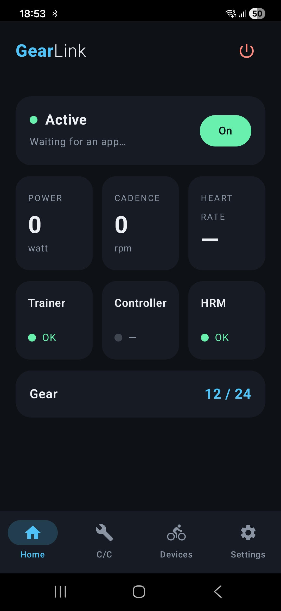
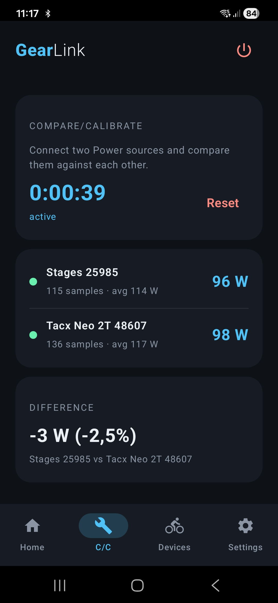
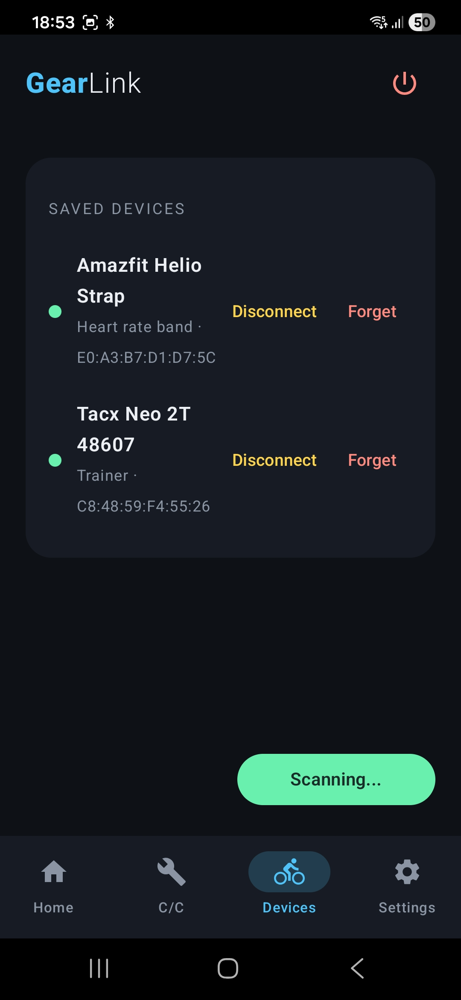
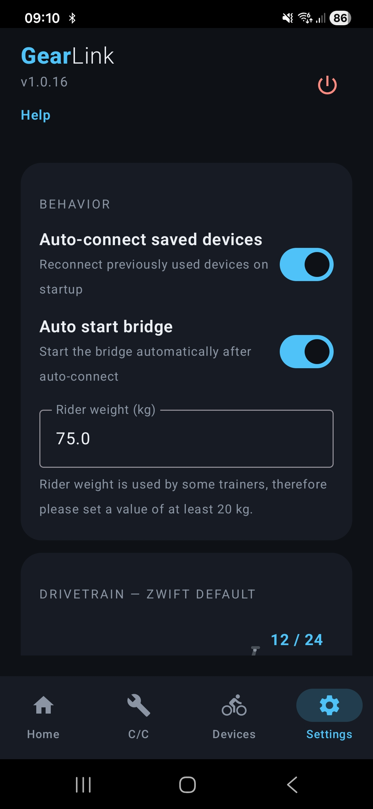
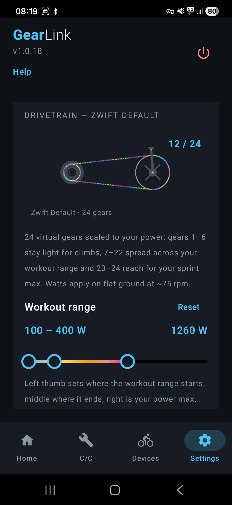
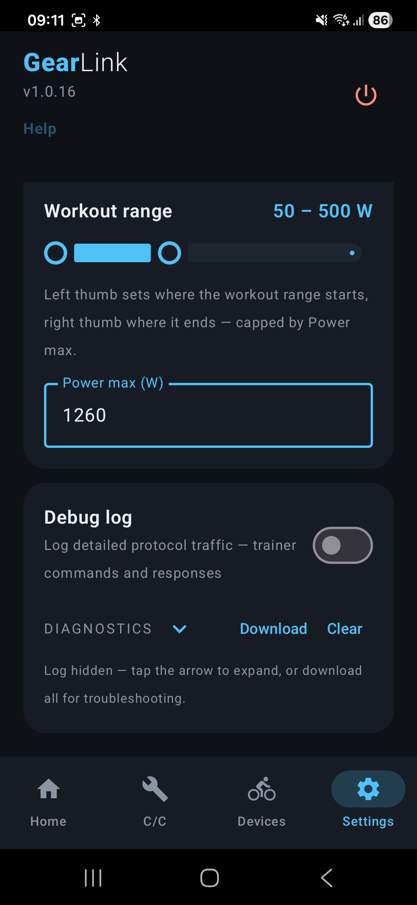
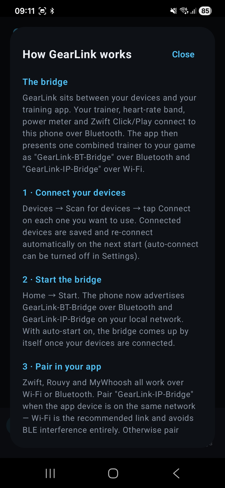
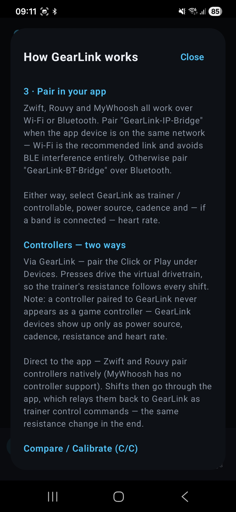
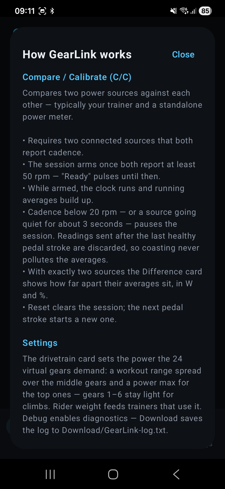

# GearLink Releases

Public releases for **GearLink** — an app that bridges smart
trainers, power meters, heart-rate sensors and wireless controllers to
cycling apps such as Zwift, Rouvy and MyWhoosh, over Bluetooth and
LAN/Wi-Fi.

Available for **Android** (`GearLink-x.y.z.apk`) and **Linux**
(`GearLink-Linux-x.y.z.jar`).

## What GearLink does

- Bridges a smart trainer (FTMS, Tacx and others) so apps see a
  standard controllable fitness machine over Bluetooth or LAN
- Forwards power, cadence, speed and heart-rate telemetry to connected
  apps
- Turns controller presses into gear shifts — each shift moves the
  virtual drivetrain and reshapes the trainer's resistance
- One dynamic 24-gear drivetrain — gear ratios scale to the rider's
  workout range and power max, from light climbing gears to a sprint
  top end
- Sim / ERG / grade and resistance control pass-through to the trainer
- Supports multiple simultaneous app connections and multiple sensors

## Install

This repository only hosts downloadable builds.

### Android

Install the latest APK from the [Releases](../../releases) page on an
Android phone. Once installed, the app notifies you under the logo
when a newer build is available and can download and install it
directly.

### Linux

Download `GearLink-Linux-x.y.z.jar` from the same release and run it
with Java 17 or newer:

```bash
java -jar GearLink-Linux-x.y.z.jar              # desktop GUI
java -jar GearLink-Linux-x.y.z.jar --headless   # headless daemon
java -jar GearLink-Linux-x.y.z.jar --help       # all options
```

The Linux build needs `bluetoothd` running and a BLE USB adapter or
on-board radio (check `bluetoothctl show` → `Powered: yes`). For
`GearLink-BT-Bridge` the adapter must support the Bluetooth
*peripheral* role; `GearLink-IP-Bridge` over LAN works on any
machine — and if no adapter is found the app still starts, shows a
notice, and serves the IP bridge only. A live status endpoint answers
at `http://127.0.0.1:36900/status`.

## Screenshots

| | | |
|---|---|---|
|  |  |  |
|  |  |  |
|  |  |  |

## How GearLink works

### The bridge

GearLink sits between your devices and your training app. Your
trainer, heart-rate band, power meter and Zwift Click/Play connect to
the phone over Bluetooth. The app then presents one combined trainer
to your game as `GearLink-BT-Bridge` over Bluetooth and
`GearLink-IP-Bridge` over Wi-Fi.

### 1 · Connect your devices

Devices → Scan for devices → tap Connect on each one you want to use.
Connected devices are saved and re-connect automatically on the next
start (auto-connect can be turned off in Settings).

### 2 · Start the bridge

Home → Start. The phone now advertises `GearLink-BT-Bridge` over
Bluetooth and `GearLink-IP-Bridge` on your local network. With
auto-start on, the bridge comes up by itself once your devices are
connected.

### 3 · Pair in your app

Zwift, Rouvy and MyWhoosh all work over Wi-Fi or Bluetooth. Pair
`GearLink-IP-Bridge` when the app device is on the same network —
Wi-Fi is the recommended link and avoids BLE interference entirely.
Otherwise pair `GearLink-BT-Bridge` over Bluetooth.

Either way, select GearLink as trainer / controllable, power source,
cadence and — if a band is connected — heart rate. GearLink devices
always appear as these sensor roles only — never as a game
controller.

### Controllers — two ways

- **Via GearLink** — pair the Click or Play under Devices. Presses
  drive the virtual drivetrain, so the trainer's resistance follows
  every shift. The controller never appears as a controller inside
  the app — GearLink devices show up only as power source, cadence,
  resistance and heart rate.
- **Direct to the app** — Zwift and Rouvy pair controllers natively
  (MyWhoosh has no controller support). Shifts then go through the
  app, which relays them back to GearLink as trainer control
  commands — the same resistance change in the end.

The drivetrain settings in Settings (workout range and power max)
apply either way.

### Network requirements (Wi-Fi bridge)

The `GearLink-IP-Bridge` and `GearLink-Controller` services are
discovered over **mDNS / DNS-SD** — standard Bonjour multicast. For
apps to find them, multicast must flow between the phone and the
device running the app:

| Service | mDNS type | Port |
|---|---|---|
| `GearLink-IP-Bridge` (trainer, DirCon) | `_wahoo-fitness-tnp._tcp` | TCP 36866 |
| `GearLink-Controller` (reserved controller channel) | `_openbikecontrol._tcp` | TCP 36868 |
| mDNS itself (discovery) | — | UDP 5353, multicast 224.0.0.251 |

Requirements:

- Both devices on the **same network/subnet** — mDNS does not cross
  VLANs or guest networks without an mDNS repeater
- **Client/AP isolation disabled** on the Wi-Fi — it blocks both the
  multicast announcements and the TCP connections themselves
- **Multicast allowed** — on some routers this means enabling IGMP
  snooping or an "mDNS/Bonjour forwarding" option
- No VPN on either device

If the router can't be configured, use `GearLink-BT-Bridge` over
Bluetooth instead — it needs no network at all.

### Compare / Calibrate (C/C)

Compares two power sources against each other — typically your
trainer and a standalone power meter.

- Requires two connected sources that both report cadence.
- The session arms once both report at least 50 rpm — "Ready" pulses
  until then.
- While armed, the clock runs and running averages build up.
- Cadence below 20 rpm — or a source going quiet for about
  3 seconds — pauses the session. Readings sent after the last
  healthy pedal stroke are discarded, so coasting never pollutes the
  averages.
- With exactly two sources the Difference card shows how far apart
  their averages sit, in W and %.
- Reset clears the session; the next pedal stroke starts a new one.

### Settings

**Drivetrain** shows the single 24-gear drivetrain.
One three-thumb slider shapes how much resistance each virtual gear
demands:

- The left and middle thumbs set your **workout range** — the watts
  where you spend most of a ride. Gears 7–22 spread across it, so
  shifting stays fine-grained exactly where you train.
- The right thumb is your **power max** — your hardest one-second
  sprint, reserved for gears 23–24.
- Gears 1–6 stay light bailout gears for climbs.

The track fades blue → red up to the power max and turns black past
it — watts in the black zone are unreachable. **Reset** restores the
defaults (100–400 W / 2200 W). **Rider weight** feeds trainers that
use it. **Debug** enables diagnostics — Download saves the log to
`Download/GearLink-log.txt`.

### Tested on

The only two Trainers I had the oppertunity to test is:

Tacx Neo2T 2850
Wahoo Kickr Core V1

## Disclaimer

The Software is not fully tested and provided as-is, intended for
private use. Use it at your own risk — the author takes no
responsibility for any damage, data loss or compatibility issues.

## License

Released under the [MIT License](LICENSE).
